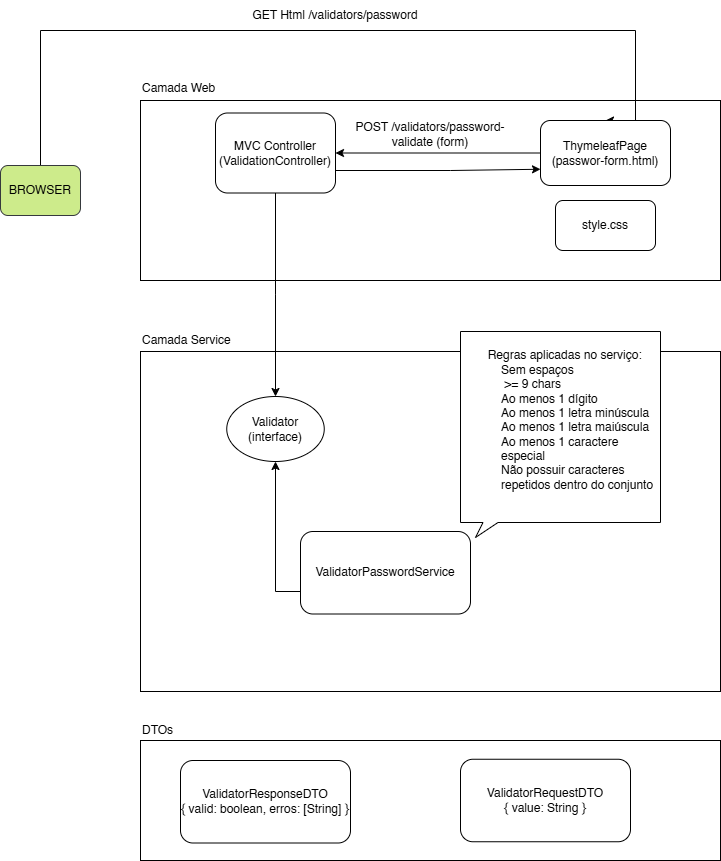

# Validador-Demo

Este projeto é uma aplicação Spring Boot / Spring MVC simples que tem-se a intenção de fazer vários validadores, a priori foi começado com a validação de senhas e com isso fornece:

- Uma página web (Thymeleaf) para teste manual de senhas;
- Um serviço de validação (`ValidatorPasswordService`) que aplica várias regras (comprimento, dígitos, letras, caracteres especiais, ausência de espaços e caracteres repetidos).

O projeto foi desenvolvido com foco didático para demonstrar padrões e boas práticas (DTOs, abstração via `Validator`, uso de Predicates e listas de regras) e para ser facilmente extensível para outros validadores (por exemplo, validador de e‑mail).

## Tecnologias

- Java 21
- Spring Boot 4 (Spring MVC)
- Thymeleaf (UI)
- JUnit 5 (testes)
- Maven 

---

## Estrutura e arquivos principais

- `src/main/java/.../controller/ValidatorController.java` — controlador MVC que serve a página e processa o POST do formulário.
- `src/main/java/.../service/ValidatorPasswordService.java` — serviço que implementa a validação de senha.
- `src/main/java/.../model/interfaces/Validator.java` — abstração do validador (injeção feita nos controllers).
- `src/main/java/.../dto/ValidatorRequestDTO.java` — DTO de entrada (`value`).
- `src/main/java/.../dto/ValidatorResponseDTO.java` — DTO de saída (`valid`, `errors`).
- `src/main/resources/templates/password-form.html` — template Thymeleaf (formulário de teste).
- `src/main/resources/static/style.css` — CSS para o layout.
- `src/test/java/...` — testes unitários para service e controller.

---

## Decisões arquiteturais e padrões

- Spring MVC + Thymeleaf: escolha simples para demonstrar o fluxo server-rendered (form GET + POST).
- `Validator` (interface): os controllers dependem de uma abstração (`Validator`) para permitir troca de implementação e facilitar testes.
- Regras como Predicates / lista: o validador aplica uma coleção de regras (Predicate + mensagem). Isso torna a configuração das regras simples e iterável.
- Uso de lista + iteration: o serviço coleta as mensagens das regras que falham e as devolve no DTO.


## Desenho da Api


   

## Como rodar (Windows)

Abra um terminal (cmd.exe) na raiz do projeto e execute:

```bash
# rodar a aplicação em modo desenvolvimento
.\mvn spring-boot:run
```

ou empacotar e executar o JAR:

```bash
.\mvn -DskipTests package
java -jar target\demo-0.0.1-SNAPSHOT.jar
```

A aplicação estará disponível por padrão em: `http://localhost:8080`.

- Página de teste (Thymeleaf): `http://localhost:8080/validators/password`


### Resposta esperada quando uma senha é válida (JSON):

```json
{ "valid": true, "errors": [] }
```

---

## Como rodar os testes

Execute os testes unitários com Maven:

```bash
.\mvn test
```

Os testes unitários existem para a `ValidatorPasswordService` e para o `ValidatorController` cobrem os cenários básicos (senha válida, muito curta, sem maiúscula/minúscula/dígito/especial, espaço, repetição, etc.).

---

